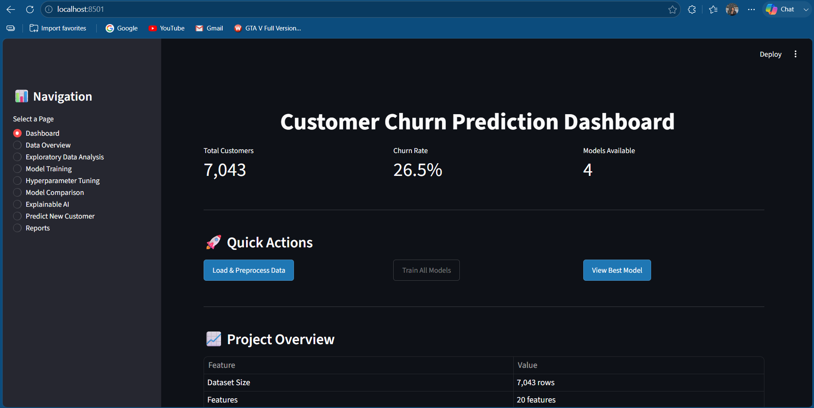
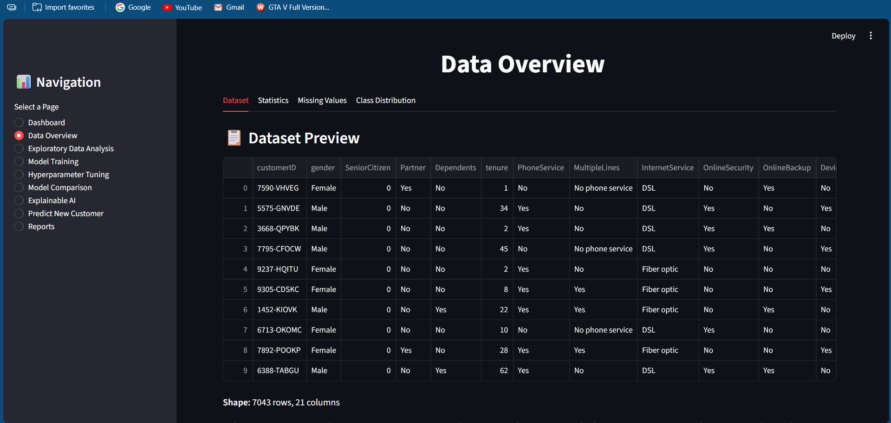
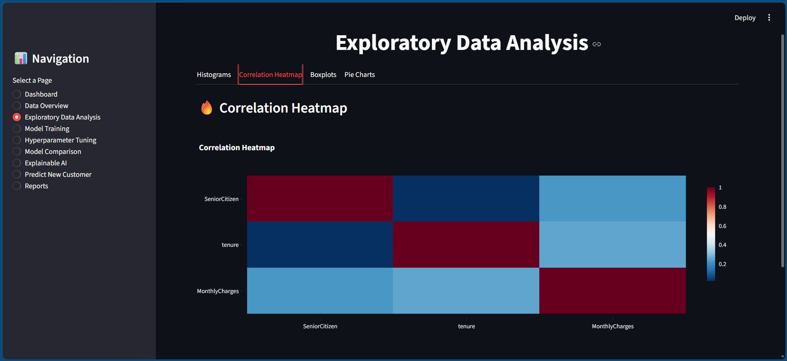
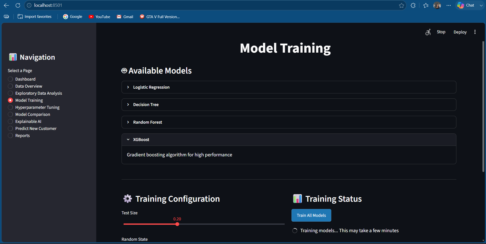
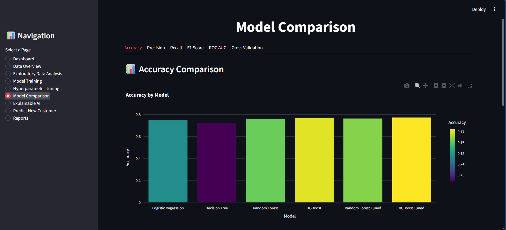
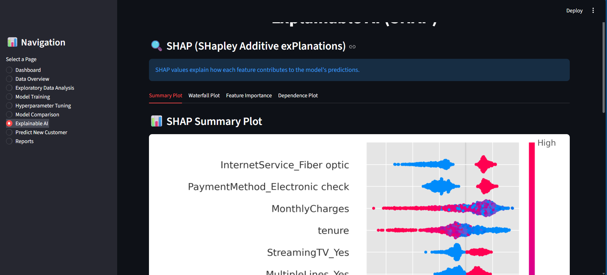
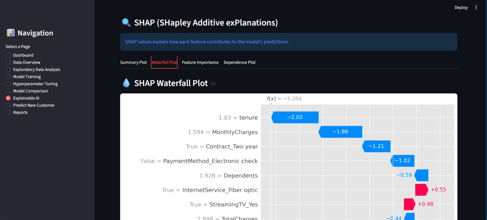
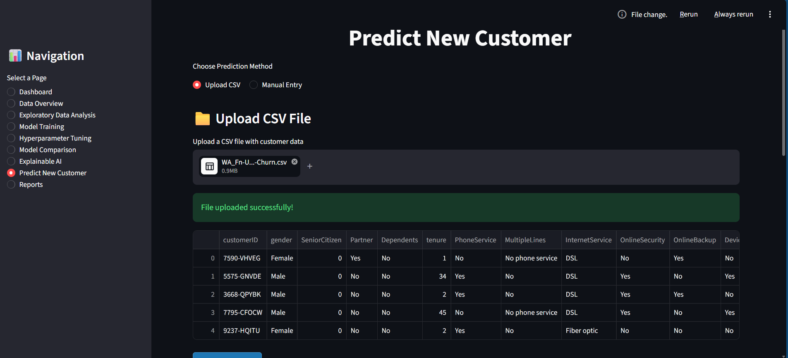
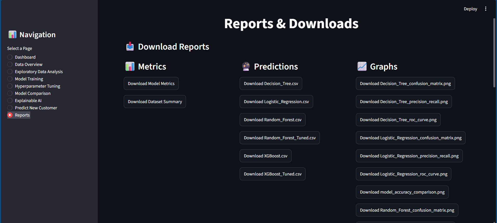

# Customer Churn Prediction Using Machine Learning and Explainable Artificial Intelligence (XAI)

## MSc Final Project

**Student Name:** Sandesh Paudel

**University:** University of Roehampton

**Programme:** MSc Computer Science

**Academic Year:** 2025–2026

---

# Project Overview

Customer churn is one of the major challenges faced by telecommunication companies. Acquiring new customers is significantly more expensive than retaining existing ones, making churn prediction an important business problem.

This project develops an intelligent customer churn prediction system using multiple Machine Learning algorithms and Explainable Artificial Intelligence (XAI). The system predicts whether a customer is likely to leave a telecommunication company while providing transparent explanations for each prediction using SHAP (Shapley Additive Explanations).

Unlike traditional black-box machine learning models, this project focuses on both prediction accuracy and model interpretability, allowing business users to understand why a customer is predicted to churn.

---

# Research Objectives

The objectives of this project are:

- Conduct a systematic literature review on customer churn prediction (2021–2026).
- Build customer churn prediction models using Machine Learning.
- Compare multiple classification algorithms.
- Evaluate models using multiple performance metrics.
- Apply Explainable Artificial Intelligence (SHAP) to improve transparency.
- Identify the most important factors influencing customer churn.
- Develop a Streamlit web application for real-time predictions.

---

# Research Gap

Most previous studies focus on improving prediction accuracy but provide limited explanation of model decisions. Many machine learning models behave as black-box systems, making it difficult for business users to trust and understand predictions.

This project addresses these limitations by integrating Explainable Artificial Intelligence (SHAP) into the prediction framework.

---

# Features

- Customer Churn Prediction
- Data Preprocessing
- Exploratory Data Analysis (EDA)
- Feature Engineering
- Multiple Machine Learning Models
- Hyperparameter Tuning
- Automatic Best Model Selection
- Explainable Artificial Intelligence (SHAP)
- Manual Customer Prediction
- Batch CSV Prediction
- Download Prediction Results
- Performance Visualization
- Streamlit Dashboard

---

# Machine Learning Models

The project compares the following algorithms:

- Logistic Regression
- Decision Tree
- Random Forest
- XGBoost

The best-performing model is automatically selected based on evaluation metrics.

---

# Explainable Artificial Intelligence

This project uses SHAP (Shapley Additive Explanations) to explain model predictions.

The generated explainability outputs include:

- SHAP Summary Plot
- SHAP Feature Importance
- SHAP Waterfall Plot
- SHAP Dependence Plot

These visualisations help identify the key factors influencing customer churn.

---

# Technologies Used

### Programming Language

- Python 3.11 / 3.12

### Libraries

- Pandas
- NumPy
- Scikit-learn
- XGBoost
- SHAP
- Matplotlib
- Seaborn
- Streamlit
- Joblib

### Development Environment

- Visual Studio Code

---

# Dataset

Dataset Source:

IBM Telco Customer Churn Dataset

https://www.kaggle.com/datasets/blastchar/telco-customer-churn

The dataset contains customer demographic information, account details, service usage, billing information, and churn status.

---

# Project Structure

```
Customer_Churn_Prediction/

│

├── app.py

├── main.py

├── config.py

├── requirements.txt

│

├── data/

│      WA_Fn-UseC_-Telco-Customer-Churn.csv

│

├── src/

│      preprocessing.py

│      eda.py

│      feature_engineering.py

│      model_training.py

│      explainability.py

│      predict.py

│

├── models/

│      best_model.pkl

│      feature_columns.pkl

│

├── outputs/

│      plots/

│      metrics/

│      predictions/

│      shap/

│

├── images/

└── README.md
```

---

# Installation

Clone the repository

```bash
git clone <repository-link>
```

Navigate to the project

```bash
cd Customer_Churn_Prediction
```

Create a virtual environment

```bash
python -m venv venv
```

Activate the environment

Windows

```bash
venv\Scripts\activate
```

Install dependencies

```bash
pip install -r requirements.txt
```

---

# Running the Project

## Train the Models

```bash
python main.py
```

This will:

- Import dataset
- Preprocess data
- Perform EDA
- Feature Engineering
- Train all models
- Compare models
- Save best model
- Generate SHAP analysis

---

## Launch the Web Application

```bash
streamlit run app.py
```

The browser will automatically open the dashboard.

---

# Performance Metrics

The models are evaluated using:

- Accuracy
- Precision
- Recall
- F1 Score
- ROC-AUC
- Confusion Matrix
- Cross Validation

---

# Project Workflow

```
Dataset

↓

Data Cleaning

↓

EDA

↓

Feature Engineering

↓

Train/Test Split

↓

Machine Learning Models

↓

Hyperparameter Tuning

↓

Model Evaluation

↓

Best Model Selection

↓

Explainable AI (SHAP)

↓

Prediction System

↓

Streamlit Dashboard
```

---

# Screenshots

## Home Dashboard


images/home_dashboard.png

---

## Dataset Overview


images/dataset_overview.png

---

## Exploratory Data Analysis


images/eda_dashboard.png

---

## Model Traning



---

## Model Traning



---


## SHAP Summary Plot



images/shap_summary.png

---

## SHAP Waterfall Plot


images/shap_waterfall.png

---


## Batch Prediction


images/batch_prediction.png

---

## Report and Download


---

# Future Improvements

Future enhancements may include:

- Deep Learning models
- LightGBM
- CatBoost
- Real-time prediction API
- Cloud deployment
- Docker containerisation
- Customer retention recommendation engine
- Integration with CRM systems

---

# References

Xu, T., Ma, Y., & Zhang, L. (2021). Customer Churn Prediction Based on Ensemble Learning Techniques.

Chang, V., et al. (2024). Prediction of Customer Churn Behaviour in the Telecommunication Industry Using Machine Learning Models.

Alotaibi, M. Z., & Haq, M. A. (2024). Customer Churn Prediction for Telecommunication Companies Using Machine Learning and Ensemble Methods.

Ouf, S., Mahmoud, K. T., & Abdel-Fattah, M. A. (2024). A Hybrid Machine Learning Framework for Customer Churn Prediction.

Sikri, A., et al. (2024). Enhancing Customer Retention Using Machine Learning-Driven Churn Prediction.

---

# Author

**Sandesh Paudel**

MSc Computer Science

University of Roehampton

2025–2026

---

# Acknowledgements

The author would like to thank the University of Roehampton, project supervisor, and the developers of the IBM Telco Customer Churn dataset for supporting this research.